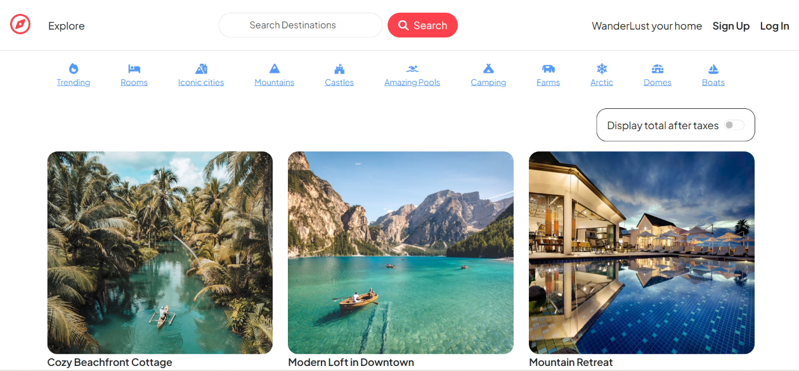
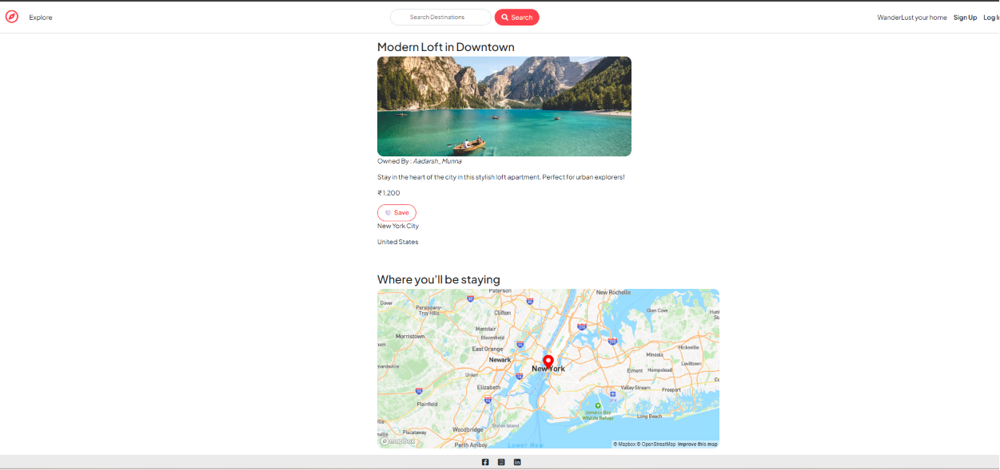
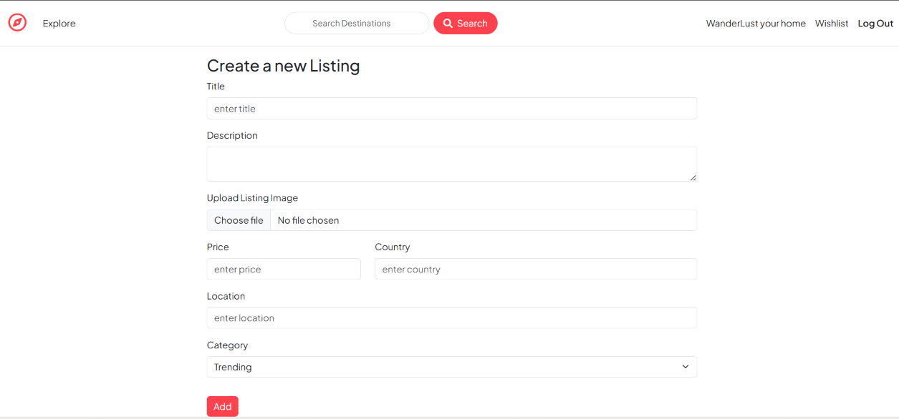
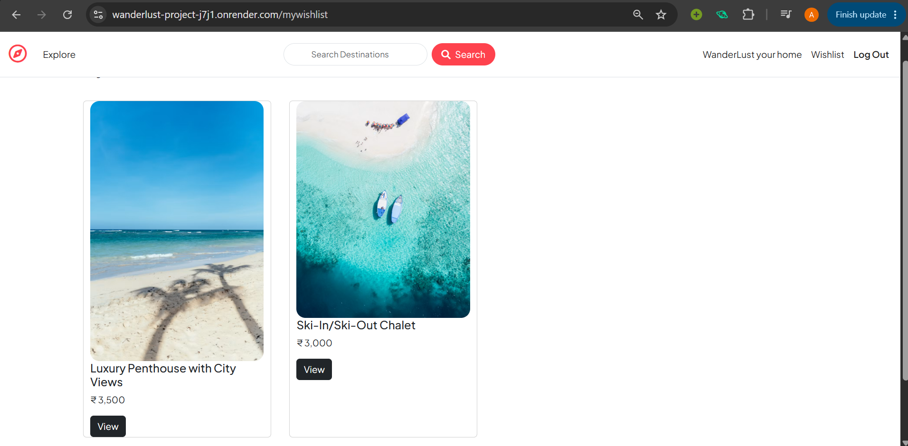
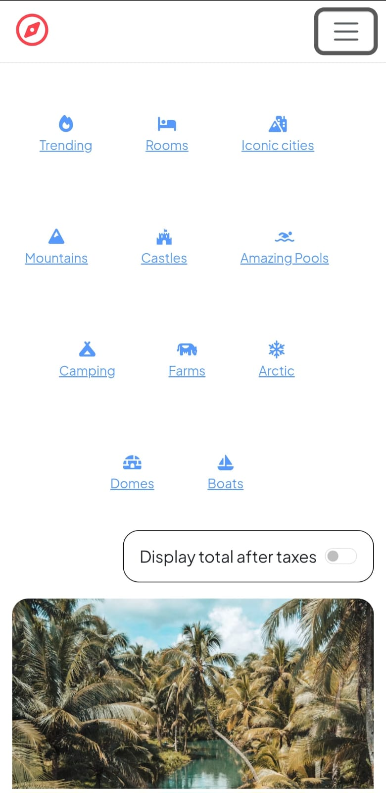

# 🌍 WanderLust

A full-stack accommodation discovery platform inspired by Airbnb, built with Node.js, Express.js, MongoDB, and EJS. WanderLust allows users to explore destinations, create and manage property listings, upload images, save favorite places, leave reviews, and discover locations through interactive maps.

The project focuses on building a secure, scalable, and user-friendly travel marketplace while following the MVC architecture and RESTful design principles.

---

## 🔗 Live Demo

** Try Application here:** https://wanderlust-project-j7j1.onrender.com

> **Note:** The application is hosted on Render's free tier. The first request may take 30–60 seconds while the server wakes up.

---

## Project Overview

WanderLust is designed as a travel accommodation platform where users can browse properties, search destinations, create listings, upload property images, manage wishlists, and interact with listings through ratings and reviews.

The application integrates cloud storage for images, cloud-hosted MongoDB, interactive maps, and secure authentication to provide a complete full-stack web application experience.

---

## Features

### User Authentication

* Secure user registration and login
* Session-based authentication using Passport.js
* Protected routes for authenticated users
* Authorization for listing owners

### Property Listings

* Create new listings
* Edit existing listings
* Delete listings
* Upload listing images
* View listing details
* Category selection for listings

### Search & Discovery

* Search listings by destination
* Browse listings by categories
* Recently added listings
* Category-based filtering

### Wishlist

* Save favourite listings
* Remove listings from wishlist
* Dedicated wishlist page

### Reviews

* Add reviews
* Rating system
* Delete personal reviews

### Maps

* Automatic location geocoding
* Interactive Mapbox map
* Marker for every property

### Image Management

* Cloudinary image upload
* Optimized cloud image storage

### Responsive Design

* Mobile-friendly layout
* Bootstrap responsive components

---

## 🛠 Tech Stack

### Frontend

* HTML5
* CSS3
* Bootstrap 5
* JavaScript
* EJS

### Backend

* Node.js
* Express.js

### Database

* MongoDB Atlas
* Mongoose

### Authentication

* Passport.js
* Passport Local
* Express Session

### Cloud Services

* Cloudinary
* Mapbox
* Render

### Other Packages

* Multer
* Joi
* Connect Flash
* Method Override
* Dotenv

---

## 📂 Project Structure

```
WanderLust
│
├── controllers
├── models
├── routes
├── views
├── public
│   ├── css
│   ├── js
│   └── images
├── middleware.js
├── cloudConfig.js
├── app.js
└── package.json
```

---

##  Installation

Clone the repository

```bash
git clone https://github.com/aadarshmunnanita27/WanderLust-Project.git
```

Move into the project directory

```bash
cd WanderLust
```

Install dependencies

```bash
npm install
```

Create a `.env` file

```env
ATLASDB_URL=

SECRET=

MAP_TOKEN=

CLOUD_NAME=

CLOUD_API_KEY=

CLOUD_API_SECRET=
```

Run the application

```bash
npm start
```

---

## 📸 Screenshots

### Home Page



---

### Listing Details



---

### Create Listing



---

### Wishlist



---

### Mobile View




---

## 💡 Technical Highlights

* MVC architecture for better code organization.
* RESTful routing.
* Session-based authentication with Passport.js.
* Image upload and storage using Cloudinary.
* Automatic geocoding using Mapbox API.
* Category-based listing system.
* Wishlist implementation using MongoDB references.
* Secure route protection using custom middleware.
* Form validation using Joi.
* Flash messaging for user feedback.
* MongoDB Atlas cloud database.
* Deployment on Render.

---

##  Future Improvements

* Booking functionality
* Payment integration
* User profile management
* Property availability calendar
* Advanced search filters
* Notification system
* Admin dashboard

---

## 👨‍💻 Author

**Aadarsh Munna**

Computer Science & Engineering

NIT Agartala


